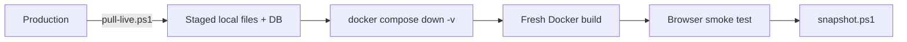
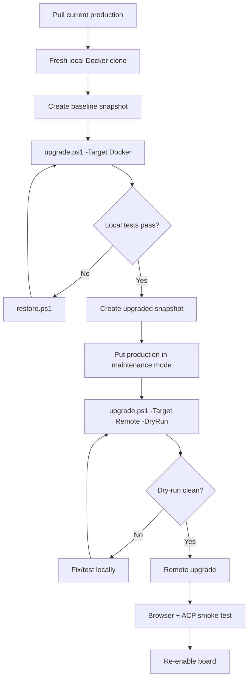
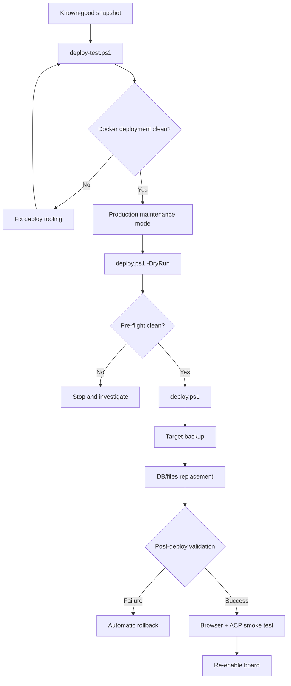

# Workflows

## Decision guide

| I need to… | Use |
|---|---|
| refresh Docker from the current live site | `pull-live.ps1` |
| checkpoint the current local Docker state | `snapshot.ps1` |
| return local Docker to a previous checkpoint | `restore.ps1` |
| test a deployment against Docker over SSH | `deploy-test.ps1` |
| deploy a known snapshot to a remote target | `deploy.ps1` |
| update phpBB within the validated 3.3.x branch | `upgrade.ps1` |
| refresh the custom style in the local phpBB tree | `sync-custom-styles.ps1` |

## Normal local refresh



## Safe phpBB upgrade



## Snapshot deployment



## What belongs in Git?

```text
Tracked:
  tooling
  Docker configuration
  maintained source/custom styles
  docs
  approved update packages

Local/ignored:
  production config.php
  production DB init dump
  snapshots
  SSH private/public test keys
  logs
  phpBB cache/store/upload runtime data
```

## Production-changing vs read-only operations

### Read/stage only

```text
pull-live.ps1
deploy.ps1 -DryRun
upgrade.ps1 ... -DryRun
```

These still connect to production and may create short-lived temporary files under `/tmp`, but they do not intentionally change the live phpBB application/database state.

### Production-changing

```text
deploy.ps1
upgrade.ps1 -Target Remote
upgrade.ps1 ... -Rollback   # when not a dry-run
```

Require the production safety checklist in `ADMIN-RUNBOOK.md`.
